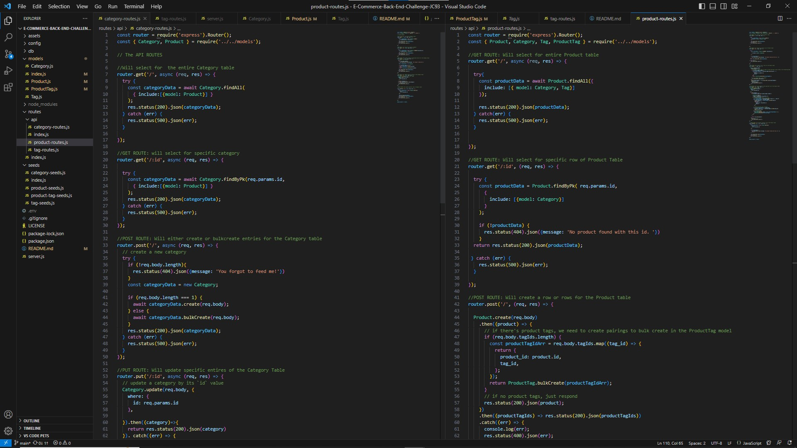

# E-Commerce-Back-End-Challenge-JC93

## Technology Used 

| Technology Used         | Resource URL           | 

| Javascript     | [https://developer.mozilla.org/en-US/docs/Web/Javascript](https://developer.mozilla.org/en-US/docs/Web/JavaScript)      | 
| mysql | [https://dev.mysql.com/doc/](https://dev.mysql.com/doc/)     |     
| express | [https://expressjs.com/](https://expressjs.com/)     |     
| sequelize | [https://sequelize.org/](https://sequelize.org/)     |   
| Git | [https://github.com/](https://github.com/)     |  
| Insomnia | [https://docs.insomnia.rest/](https://docs.insomnia.rest/)     |  

## Acceptance Criteria

GIVEN a functional Express.js API
WHEN I add my database name, MySQL username, and MySQL password to an environment variable file
THEN I am able to connect to a database using Sequelize
WHEN I enter schema and seed commands
THEN a development database is created and is seeded with test data
WHEN I enter the command to invoke the application
THEN my server is started and the Sequelize models are synced to the MySQL database
WHEN I open API GET routes in Insomnia Core for categories, products, or tags
THEN the data for each of these routes is displayed in a formatted JSON
WHEN I test API POST, PUT, and DELETE routes in Insomnia Core
THEN I am able to successfully create, update, and delete data in my database

  

## Description

A server-side, command line application that utilizes mysql2, sequelizer, express and dotenv to allow users to add, delete, and make changes to tables that have the application creates and stores on a live server. 

 OR (https://drive.google.com/file/d/1M0wURl6KndrMOVEAKaLze6olUkWWfVgk/view)

## Installation

1. Download Repository
2. Navigate to Root Directory
3. Run npm install

## Usage

1. Complete Installation
2. Run: mysql -u root -p
3. Enter password: password
4. Run: source db/schema.sql
5. Run: quit
6. Run: npm run seed
8. Run: npm start
9. The routes are now accessible through insomnia.

## Learning Points

The purpose of this challenge was to practice working with sequelize, to make dynamic changes to mysql data, without having to leave the javascript dev environment. 

## Credits

* [LinkedIn](https://linkedin.com/in/justinchoica)
* [Github](https://github.com/justinschoi93)
* [Email](justinschoi93@gmail.com)
